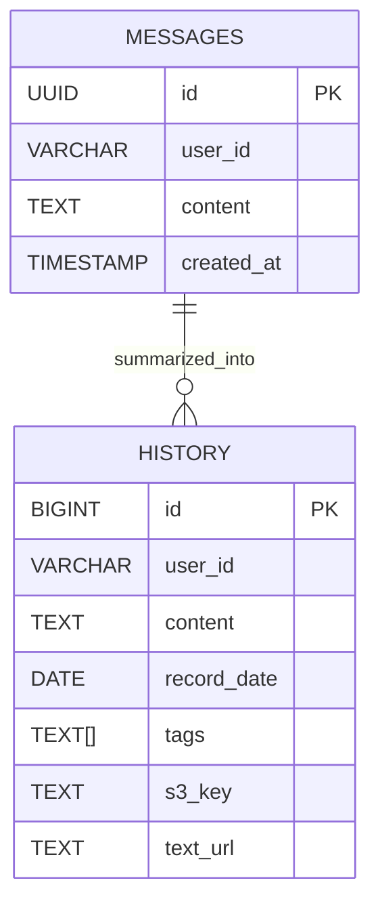

# Database ERD (Entity Relationship Diagram)

## 개요
Journal 애플리케이션의 데이터베이스 구조를 설명합니다.
PostgreSQL을 사용하며, 메시지와 히스토리 두 개의 주요 테이블로 구성됩니다.

---

## 1. 테이블 구조

### 1.1 Messages 테이블
일일 메시지를 저장하는 테이블입니다.

```sql
CREATE TABLE messages (
    id UUID PRIMARY KEY DEFAULT gen_random_uuid(),
    user_id VARCHAR(255) NOT NULL,
    content TEXT NOT NULL,
    created_at TIMESTAMP WITH TIME ZONE DEFAULT NOW() NOT NULL
);

CREATE INDEX idx_messages_user_id ON messages(user_id);
CREATE INDEX idx_messages_created_at ON messages(created_at);
```

| 컬럼명 | 타입 | 제약조건 | 설명 |
|--------|------|----------|------|
| id | UUID | PRIMARY KEY | 메시지 고유 식별자 |
| user_id | VARCHAR(255) | NOT NULL, INDEX | 사용자 식별자 |
| content | TEXT | NOT NULL | 메시지 내용 |
| created_at | TIMESTAMP WITH TIME ZONE | NOT NULL, DEFAULT NOW() | 생성 시간 |

### 1.2 History 테이블
요약된 일기 내용을 저장하는 테이블입니다.

```sql
CREATE TABLE history (
    id BIGSERIAL PRIMARY KEY,
    user_id VARCHAR(255) NOT NULL,
    content TEXT NOT NULL,
    record_date DATE NOT NULL,
    tags TEXT[],
    s3_key TEXT,
    text_url TEXT
);

CREATE INDEX idx_history_user_id ON history(user_id);
CREATE INDEX idx_history_record_date ON history(record_date);
CREATE UNIQUE INDEX idx_history_user_date ON history(user_id, record_date);
```

| 컬럼명 | 타입 | 제약조건 | 설명 |
|--------|------|----------|------|
| id | BIGSERIAL | PRIMARY KEY | 히스토리 고유 식별자 |
| user_id | VARCHAR(255) | NOT NULL, INDEX | 사용자 식별자 |
| content | TEXT | NOT NULL | 요약된 일기 내용 |
| record_date | DATE | NOT NULL, INDEX | 기록 날짜 |
| tags | TEXT[] | NULLABLE | 태그 배열 |
| s3_key | TEXT | NULLABLE | 이미지 S3 URL |
| text_url | TEXT | NULLABLE | 텍스트 파일 S3 URL |

---

## 2. ERD 다이어그램



---

## 3. 관계 설명

### 3.1 Messages → History
- **관계**: 1:N (하나의 히스토리는 여러 메시지로부터 생성)
- **연결**: user_id와 날짜를 통한 논리적 관계
- **설명**: 같은 사용자의 같은 날짜 메시지들이 하나의 히스토리로 요약됨

### 3.2 외래키 관계
현재 명시적인 외래키는 없으며, 애플리케이션 레벨에서 관계를 관리합니다.
- user_id를 통한 사용자별 데이터 분리
- 날짜를 통한 메시지-히스토리 연관성

---

## 4. 인덱스 전략

### 4.1 Messages 테이블 인덱스
```sql
-- 사용자별 메시지 조회 최적화
CREATE INDEX idx_messages_user_id ON messages(user_id);

-- 날짜별 메시지 조회 최적화
CREATE INDEX idx_messages_created_at ON messages(created_at);

-- 복합 인덱스 (사용자 + 날짜)
CREATE INDEX idx_messages_user_date ON messages(user_id, created_at);
```

### 4.2 History 테이블 인덱스
```sql
-- 사용자별 히스토리 조회 최적화
CREATE INDEX idx_history_user_id ON history(user_id);

-- 날짜별 히스토리 조회 최적화
CREATE INDEX idx_history_record_date ON history(record_date);

-- 유니크 제약조건 (사용자당 하루 하나의 히스토리)
CREATE UNIQUE INDEX idx_history_user_date ON history(user_id, record_date);

-- 태그 검색 최적화 (GIN 인덱스)
CREATE INDEX idx_history_tags ON history USING GIN(tags);
```

---

## 5. 데이터 흐름

### 5.1 일반적인 데이터 흐름
```
1. 사용자 입력 → Flow API → 분류
   ├── 데이터 → Messages 테이블 저장
   └── 질문 → 답변만 반환 (저장 안함)

2. 메시지 요약 → Summary API
   ├── Messages 테이블에서 당일 메시지 조회
   ├── AI 요약 생성
   ├── History 테이블에 저장
   └── S3에 텍스트 파일 저장

3. 히스토리 직접 저장 → History API
   ├── History 테이블에 저장
   └── S3에 텍스트 파일 저장
```

### 5.2 S3 연동
```
History 테이블의 S3 관련 컬럼:
├── s3_key: 이미지 파일 URL
└── text_url: 텍스트 파일 URL

S3 저장 경로:
└── {user_id}/history/{YYYY}/{MM}/{YYYY-MM-DD}.txt
```

---

## 6. 제약조건 및 비즈니스 룰

### 6.1 데이터 제약조건
- **Messages**: 사용자당 무제한 메시지 저장 가능
- **History**: 사용자당 하루 하나의 히스토리만 저장 (UNIQUE 제약)
- **날짜 처리**: 모든 날짜는 한국 시간(KST) 기준으로 처리

### 6.2 비즈니스 룰
- 메시지는 생성 시간 기준으로 당일 메시지만 조회
- 히스토리 생성 시 같은 날짜가 있으면 덮어쓰기
- S3 파일과 DB 레코드는 동기화되어야 함
- 태그는 배열 형태로 저장되며 중복 허용

---

## 7. 성능 고려사항

### 7.1 쿼리 최적화
- 사용자별 데이터 조회 시 user_id 인덱스 활용
- 날짜 범위 조회 시 날짜 인덱스 활용
- 태그 검색 시 GIN 인덱스 활용

### 7.2 파티셔닝 고려사항
대용량 데이터 처리 시 고려할 파티셔닝 전략:
```sql
-- 날짜별 파티셔닝 (월 단위)
CREATE TABLE messages_2026_01 PARTITION OF messages
FOR VALUES FROM ('2026-01-01') TO ('2026-02-01');

-- 사용자별 파티셔닝 (해시)
CREATE TABLE messages_hash_0 PARTITION OF messages
FOR VALUES WITH (MODULUS 4, REMAINDER 0);
```

---

## 8. 마이그레이션 스크립트

### 8.1 초기 테이블 생성
```sql
-- Messages 테이블
CREATE TABLE messages (
    id UUID PRIMARY KEY DEFAULT gen_random_uuid(),
    user_id VARCHAR(255) NOT NULL,
    content TEXT NOT NULL,
    created_at TIMESTAMP WITH TIME ZONE DEFAULT NOW() NOT NULL
);

-- History 테이블
CREATE TABLE history (
    id BIGSERIAL PRIMARY KEY,
    user_id VARCHAR(255) NOT NULL,
    content TEXT NOT NULL,
    record_date DATE NOT NULL,
    tags TEXT[],
    s3_key TEXT,
    text_url TEXT
);
```

### 8.2 인덱스 생성
```sql
-- Messages 인덱스
CREATE INDEX idx_messages_user_id ON messages(user_id);
CREATE INDEX idx_messages_created_at ON messages(created_at);
CREATE INDEX idx_messages_user_date ON messages(user_id, created_at);

-- History 인덱스
CREATE INDEX idx_history_user_id ON history(user_id);
CREATE INDEX idx_history_record_date ON history(record_date);
CREATE UNIQUE INDEX idx_history_user_date ON history(user_id, record_date);
CREATE INDEX idx_history_tags ON history USING GIN(tags);
```

---

## 9. 백업 및 복구 전략

### 9.1 백업 전략
```bash
# 전체 데이터베이스 백업
pg_dump -h localhost -U username -d journal_db > backup_$(date +%Y%m%d).sql

# 테이블별 백업
pg_dump -h localhost -U username -d journal_db -t messages > messages_backup.sql
pg_dump -h localhost -U username -d journal_db -t history > history_backup.sql
```

### 9.2 복구 전략
```bash
# 전체 복구
psql -h localhost -U username -d journal_db < backup_20260101.sql

# 테이블별 복구
psql -h localhost -U username -d journal_db < messages_backup.sql
```

---

## 10. API 응답 스키마 업데이트

### 10.1 SummaryExistsResponse 스키마 변경
```python
class SummaryExistsResponse(BaseModel):
    exists: bool
    id: int | None = None          # 히스토리 ID (새로 추가됨)
    record_date: date | None = None
    summary: str | None = None
    s3_key: str | None = None
```

### 10.2 업데이트된 API 응답 예시
**GET /summary/check/{user_id} 응답:**
```json
{
  "exists": true,
  "id": 123,                     // 프론트엔드에서 사용할 히스토리 ID
  "record_date": "2026-01-01",
  "summary": "요약 내용...",
  "s3_key": "이미지_URL"
}
```

### 10.3 변경 이유
- 프론트엔드에서 히스토리 ID가 필요했지만 기존 응답에는 포함되지 않음
- `{ exists: true, id: "123" }` 형태의 응답을 기대했으나 실제로는 다른 구조였음
- 호환성을 위해 기존 필드는 유지하고 `id` 필드만 추가

이 변경으로 프론트엔드에서 히스토리 ID를 직접 받아 사용할 수 있게 되었습니다.